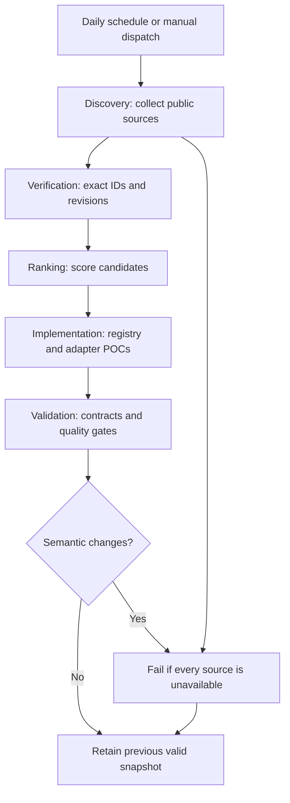

## Workflow Overview

**Purpose**: Periodically collect reproducible public evidence leads for mobile-specific open-source model research without an OpenAI API key.
**Trigger Events**: Daily scheduled run at 02:30 UTC (08:00 Asia/Kolkata) and manual dispatch on the default branch.
**Target Environments**: GitHub-hosted Ubuntu runner; repository `main`.

## Execution Flow Diagram



## Jobs & Dependencies

| Job Name | Purpose | Dependencies | Execution Context |
|---|---|---|---|
| `collect-and-validate` | Fetch public metadata, write a dated snapshot, validate it, run tests, and push validated changes | None | GitHub-hosted Ubuntu runner |

## Requirements Matrix

### Functional Requirements

| ID | Requirement | Priority | Acceptance Criteria |
|---|---|---|---|
| REQ-001 | Query public Hugging Face mobile/edge search results | High | Snapshot contains normalized model leads or a visible source error |
| REQ-002 | Query official mobile runtime repositories | High | Snapshot records Apple/PyTorch/Google repository metadata when available |
| REQ-003 | Capture public community discovery signals | Medium | Hacker News, Reddit, and Bluesky results are normalized or report errors |
| REQ-004 | Produce a maximum-three heuristic shortlist | High | Every shortlist entry links to a Hugging Face repository, states that review is required, and the dated POC selection contains exactly the top three admitted records |
| REQ-005 | Preserve partial source failures | High | Successful sources are committed with failed-source errors visible |
| REQ-006 | Consider all useful on-device modalities | High | Discovery records text, VLM, OCR/vision, audio/speech, TTS, embeddings, generation, detection, and segmentation leads; admission remains exact-ID/revision gated |
| REQ-007 | Use a registry and reusable adapter boundary | High | Native and fixture POCs resolve the verified inventory through `tools/research/model-registry.mjs` and expose platform strategies |
| REQ-008 | Make refreshes idempotent | High | Same semantic fingerprint preserves the dated snapshot and exits through a visible no-change path |
| REQ-009 | Prefer genuinely new POC candidates | Medium | A refresh may replace a prior POC selection with higher-ranked admitted records, but it must not repeat prior selections when new records clear the same exact-ID/revision gate |

### Security Requirements

| ID | Requirement | Implementation Constraint |
|---|---|---|
| SEC-001 | Require no provider credential | No OpenAI secret or third-party API token is referenced |
| SEC-002 | Do not commit sensitive payloads | Only allowlisted normalized fields are written; weights, tokens, and raw responses are excluded |
| SEC-003 | Restrict write access | Workflow writes repository contents only on the default branch |

## Input/Output Contracts

### Inputs

```yaml
triggers:
  schedule: daily, 02:30 UTC
  manual: workflow_dispatch
public_endpoints:
  - Hugging Face model API
  - GitHub repository API
  - Hacker News Algolia API
  - Reddit public search API
  - Bluesky public search API
```

### Outputs

```yaml
snapshot: data/research/remote/remote-mobile-llm-<utc-date>.json
human_readable_report: data/research/remote/remote-mobile-llm-<utc-date>.md
```

### Secrets & Variables

No secrets or repository variables are required.

## Execution Constraints

- **Timeout**: 20 minutes for the job; 20 seconds per public request.
- **Concurrency**: One collector run at a time; queued runs are not cancelled.
- **Idempotence**: Semantic fingerprint excludes observation timestamps and stable snapshot IDs; unchanged normalized content creates no commit.
- **Network Access**: Public HTTPS endpoints only.
- **Permissions**: `contents: write` for validated commits to `main`.

## Error Handling Strategy

| Error Type | Response | Recovery Action |
|---|---|---|
| Individual source unavailable | Record source error and continue | Commit successful sources if at least one source succeeds |
| All sources unavailable | Exit non-zero before writing a valid snapshot | Keep the last valid snapshot unchanged |
| Snapshot contract failure | Exit non-zero | Fix collector before rerun |
| Repository quality gate failure | Exit non-zero before commit | Investigate and rerun after correction |
| No content changes | Complete successfully without commit | Wait for next schedule or manual dispatch |

## Quality Gates

| Gate | Criteria | Bypass Conditions |
|---|---|---|
| Snapshot contract | Latest JSON passes collector validation and has at least one successful source | None |
| Repository tests | Existing `npm test`, `npm run validate`, and research gates pass | None |
| Git hygiene | `git diff --check` passes and only scoped paths are staged | None |

## Monitoring & Observability

- GitHub Actions logs report source availability, shortlist count, and output paths.
- Failed runs are visible in the repository Actions tab.
- Every committed snapshot retains collection time, source status, item counts, and source URLs.

## Compliance & Governance

- Community content is treated as untrusted discovery input.
- No model weights, credentials, private device data, or raw network payloads may enter the repository.
- Popularity/community signals never change the verified inventory automatically.

## Validation Criteria

- **VLD-001**: A run with at least one successful source creates a JSON and Markdown snapshot.
- **VLD-002**: A run with all sources unavailable exits non-zero and does not replace the latest valid snapshot.
- **VLD-003**: The shortlist has no more than three entries and each entry has a repository ID.
- **VLD-004**: The workflow has no `OPENAI_API_KEY` dependency.

## Change Management

1. Update this specification when source scope or write behavior changes.
2. Modify the collector and workflow.
3. Run the local test and validation commands.
4. Review the generated snapshot for secrets, weights, and unsupported readiness claims.
5. Push only the validated workflow and evidence changes.

## Version History

| Version | Date | Changes | Author |
|---|---|---|---|
| 1.0 | 2026-09-17 | Replaced API-dependent Codex job with free public-source collector | ModelOrbit maintainers |
| 1.1 | 2026-09-18 | Added modality-wide discovery, exact three-model ranking, registry/adapter fixture, and daily idempotent delivery | ModelOrbit maintainers |
